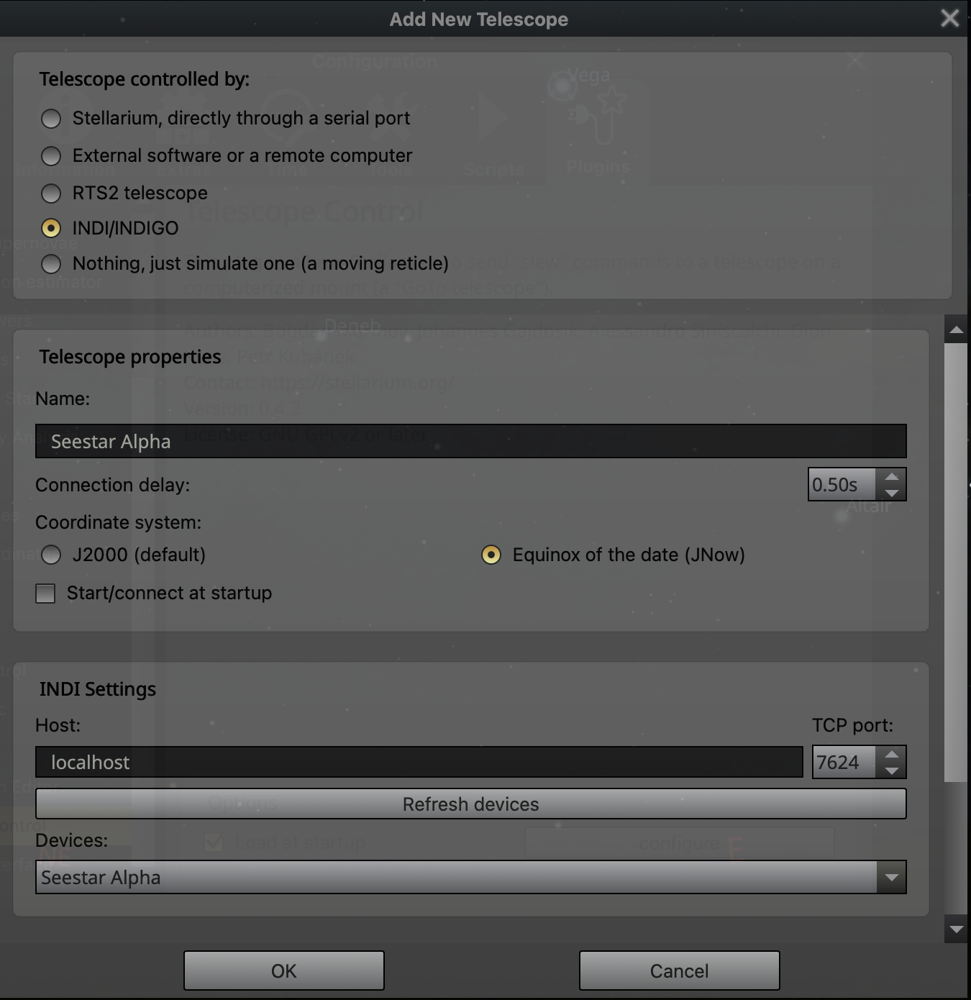
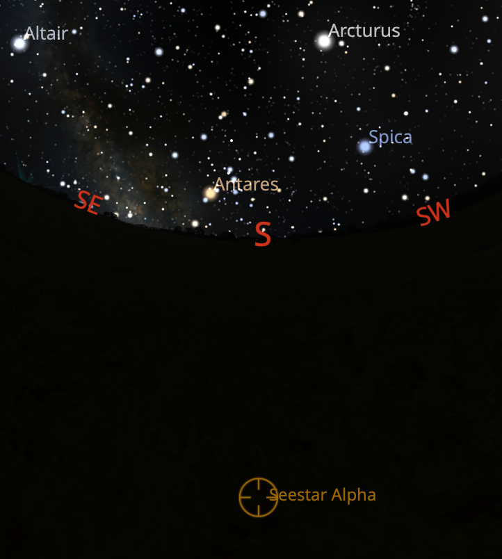

## Running seestar_alp with INDI and without Docker

### The Problem
I have not been able to find a build for the INDI platform alone, other than one on Mac Ports that has not been updated in over two years (https://ports.macports.org/port/indi/) and which I haven't tried.

However, `indiserver` comes bundled with the KStars app.  So I recommend going this route.  Unfortunately, the KStars app is an Intel application which complicates things.  When the INDI server starts a device driver written in Python, it appears to do so using the Intel architecture, so we need to put together an Intel Python virtual environment with all the required dependencies.

### KStars installation 

Download and install KStars from [https://kstars.kde.org/download/](https://kstars.kde.org/download/)

### Set up an Intel Python Virtual Environment

- Open a terminal window and switch to the Intel architecture. There's a nice article [here](https://vineethbharadwaj.medium.com/m1-mac-switching-terminal-between-x86-64-and-arm64-e45f324184d9) which will walk you through the process
- Set the `seestar_alp` directory as your current directory and create a Python virtual environment:  
`python3 -m venv venv-intel`
- Activate the virtual environment:  
`source venv-intel/bin/activate`
- Install dependencies:  
`pip3 install -r requirements.txt`
- Install pyindi (requires git):  
`pip3 install git+https://github.com/MMTObservatory/pyINDI.git`

### Getting everything up and running

- Each time you want to run `seestar_alp` with the front end and the INDI server, you will need three terminal windows.  Activate the Intel architecture and the `venv-intel` virtual environment in each of them, as described above
- In the first, change to the `seestar_alp/device` directory and start the app:  
`python3 app.py &`  
- In the second change to the `seestar_alp/front` directory and start the app:  
`python3 app.py`  
- In the third change to the `seestar_alp` directory, then start the INDI server:  
`mkfifo /tmp/seestar`  
`/Applications/KStars.app/Contents/MacOS/indiserver -f /tmp/seestar &`  
If prompted to allow network connections, click *Allow*. Start an INDI device driver for each of the Seestars configured in `device/config.toml`:  
`python3 ./indi-no-docker/start-indi-devices.py`  
- Connect to the front end through your browser: [http://127.0.0.1/5432](http://127.0.0.1/5432)

### Configuring Stellarium
- Open the *Configuration Window* in Stellarium
- Select *Plugins*
- Select *Telescope Control* from list on left and check *Load at Startup*
- Click *Configure*
- Click *Add new telescope* and configure as follows (you will have to click *Refresh Devices* to see the list of Seestars - the names will match those in the `config.toml` file)

- Click OK and then Connect
- If you have more than one Seestar add a new telescope for each.
- The location of your Seestar(s) should now be displayed on the Stellarium sky atlas (it will appear below the horizon if it is still in the closed position)

*NOTE*: The INDI device driver supports only Sync and Slew operations! 
